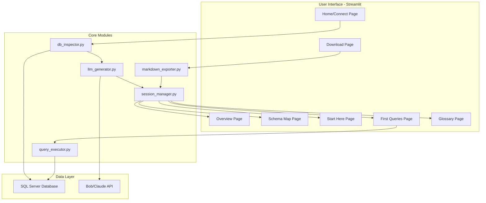

# Rosetta Implementation Plan
**IBM Bob Hackathon - Solo Build**  
**Timeline**: 45 hours remaining  
**Budget**: 37 Bobcoins remaining (target: 35 spent on build)  
**Repository**: github.com/Raven-V1/rosetta

---

## Executive Summary

Rosetta is a multi-page Streamlit application that automatically generates interactive database onboarding documentation. It connects to SQL Server databases, introspects the schema, uses LLM to generate contextual documentation, and presents an interactive learning experience for new developers.

**Key Innovation**: The Schema Map page provides a visual, interactive diagram of table relationships grouped by functional area - the distinctive feature that sets Rosetta apart from static documentation tools.

---

## System Architecture



---

## Data Flow

1. **Connection Phase** (Home page)
   - User enters SQL Server connection string
   - [`db_inspector.py`](src/db_inspector.py) validates connection
   - Stores connection in [`session_manager.py`](src/session_manager.py)

2. **Introspection Phase** (triggered on successful connection)
   - [`db_inspector.py`](src/db_inspector.py) queries system tables for schema metadata
   - Extracts: tables, columns, data types, primary keys, foreign keys, indexes
   - Passes structured data to [`llm_generator.py`](src/llm_generator.py)
   - **Target time**: <60 seconds for AdventureWorks (70 tables)

3. **Generation Phase** (LLM processing)
   - [`llm_generator.py`](src/llm_generator.py) makes 3-4 Bob API calls:
     - Call 1: Database overview summary (1 coin)
     - Call 2: Table groupings and descriptions (1-2 coins)
     - Call 3: "Start Here" ranking with reasoning (1 coin)
     - Call 4: Sample queries with annotations (1 coin)
   - All results cached in session state
   - **Budget**: 4-5 Bobcoins per introspection run

4. **Navigation Phase** (all pages)
   - Pages read from session state (no re-querying)
   - Schema Map renders from cached relationship data
   - First Queries executes live queries via [`query_executor.py`](src/query_executor.py)

5. **Export Phase** (Download page)
   - [`markdown_exporter.py`](src/markdown_exporter.py) assembles all cached data
   - Generates single Markdown file with all sections

---

## Tech Stack & Library Choices

### Database Connectivity
**Choice**: `pyodbc` (not pymssql)  
**Rationale**:
- Native Microsoft ODBC driver support
- Better Windows integration for SQL Server Authentication
- More robust connection string parsing
- Streamlit Cloud compatible (ODBC Driver 17 for SQL Server available)
- Handles AdventureWorks complexity (views, stored procedures metadata)

**Connection String Format**:
```
Driver={ODBC Driver 17 for SQL Server};Server=localhost;Database=AdventureWorks2025;UID=sa;PWD=password;
```

### LLM Integration
**Choice**: `anthropic` Python SDK  
**Rationale**:
- Direct Claude API access (Bob uses Claude)
- Structured output support for JSON responses
- Streaming not needed (batch generation)
- Cost tracking built-in

**Alternative**: If Bob API requires custom endpoint, use `requests` with Bob's API format

### Schema Visualization
**Choice**: `streamlit-agraph` (not pyvis or networkx alone)  
**Rationale**:
- **pyvis**: Generates HTML files, doesn't embed cleanly in Streamlit
- **networkx + matplotlib**: Static images, no interactivity
- **streamlit-agraph**: Built for Streamlit, interactive, clickable nodes, force-directed layout
- Handles 70 nodes (AdventureWorks) without performance issues
- Supports node grouping by color/shape for functional areas

**Fallback**: If streamlit-agraph fails on Streamlit Cloud, use `graphviz` with clickable SVG

### UI Framework
**Choice**: Streamlit 1.31+ with native multi-page apps  
**Rationale**:
- No need for custom routing
- Automatic sidebar navigation
- Session state persistence across pages
- Free deployment on Streamlit Community Cloud

### Data Handling
**Choice**: `pandas` for tabular data display  
**Rationale**:
- Native Streamlit integration (`st.dataframe`)
- Easy CSV export for query results
- Handles AdventureWorks result sets efficiently

### Markdown Export
**Choice**: Python `f-strings` + `textwrap` (no external library)  
**Rationale**:
- Simple template-based generation
- No dependency overhead
- Full control over formatting

---

## Component Breakdown

### 1. Database Inspector (`src/db_inspector.py`)
**Responsibility**: Extract all schema metadata from SQL Server  
**Single Responsibility**: Database introspection only, no LLM calls

**Key Functions**:
- `validate_connection(conn_string: str) -> bool`
- `get_database_metadata(conn_string: str) -> dict`
  - Returns: `{tables: [], columns: [], relationships: [], indexes: []}`
- `get_table_row_counts(conn_string: str, tables: list) -> dict`
- `get_sample_data(conn_string: str, table: str, limit: int) -> pd.DataFrame`

**SQL Queries** (parameterized):
```sql
-- Tables
SELECT TABLE_SCHEMA, TABLE_NAME, TABLE_TYPE 
FROM INFORMATION_SCHEMA.TABLES 
WHERE TABLE_TYPE = 'BASE TABLE'

-- Columns
SELECT TABLE_SCHEMA, TABLE_NAME, COLUMN_NAME, DATA_TYPE, 
       CHARACTER_MAXIMUM_LENGTH, IS_NULLABLE
FROM INFORMATION_SCHEMA.COLUMNS

-- Foreign Keys
SELECT 
    fk.name AS FK_NAME,
    tp.name AS PARENT_TABLE,
    cp.name AS PARENT_COLUMN,
    tr.name AS REFERENCED_TABLE,
    cr.name AS REFERENCED_COLUMN
FROM sys.foreign_keys fk
INNER JOIN sys.tables tp ON fk.parent_object_id = tp.object_id
INNER JOIN sys.tables tr ON fk.referenced_object_id = tr.object_id
INNER JOIN sys.foreign_key_columns fkc ON fk.object_id = fkc.constraint_object_id
INNER JOIN sys.columns cp ON fkc.parent_column_id = cp.column_id AND fkc.parent_object_id = cp.object_id
INNER JOIN sys.columns cr ON fkc.referenced_column_id = cr.column_id AND fkc.referenced_object_id = cr.object_id
```

**Bobcoin Cost**: 0 (no LLM calls)

---

### 2. LLM Generator (`src/llm_generator.py`)
**Responsibility**: Generate all human-readable documentation via Bob API  
**Single Responsibility**: LLM orchestration only, no database access

**Key Functions**:
- `generate_overview(metadata: dict) -> str`
- `generate_table_descriptions(tables: list) -> dict[str, str]`
- `generate_table_groupings(metadata: dict) -> dict[str, list]`
- `rank_important_tables(metadata: dict) -> list[dict]`
- `generate_sample_queries(metadata: dict) -> list[dict]`

**Prompt Engineering Strategy**:
- Include table names, column names, relationships in context
- Request structured JSON output for parsing
- Limit context to 50 most important tables for large databases
- Use few-shot examples for query generation

**Example Prompt** (Start Here ranking):
```
Given this database schema, identify the 3-5 most important tables a new developer 
should understand first. For each table, provide:
1. Table name
2. One-sentence description
3. Why it's important (2-3 sentences)
4. What it connects to

Return as JSON array: [{"table": "...", "description": "...", "reasoning": "...", "connections": [...]}]

Schema:
{metadata_json}
```

**Bobcoin Cost**: 4-5 coins per full introspection (4 API calls)

---

### 3. Session Manager (`src/session_manager.py`)
**Responsibility**: Manage Streamlit session state for cached data  
**Single Responsibility**: State persistence only

**Key Functions**:
- `initialize_session() -> None`
- `store_metadata(metadata: dict) -> None`
- `get_metadata() -> dict`
- `store_generated_content(content: dict) -> None`
- `get_generated_content() -> dict`
- `is_connected() -> bool`
- `clear_session() -> None`

**Session State Schema**:
```python
st.session_state = {
    'connected': bool,
    'conn_string': str,
    'metadata': {
        'tables': [...],
        'columns': [...],
        'relationships': [...],
        'row_counts': {...}
    },
    'generated': {
        'overview': str,
        'table_descriptions': {...},
        'table_groups': {...},
        'important_tables': [...],
        'sample_queries': [...]
    },
    'introspection_time': float
}
```

**Bobcoin Cost**: 0

---

### 4. Query Executor (`src/query_executor.py`)
**Responsibility**: Execute user-triggered queries safely  
**Single Responsibility**: Query execution with security

**Key Functions**:
- `execute_query(conn_string: str, query: str, params: dict = None) -> pd.DataFrame`
- `validate_query(query: str) -> bool` (check for DROP, DELETE, UPDATE, etc.)
- `execute_with_timeout(conn_string: str, query: str, timeout: int = 30) -> pd.DataFrame`

**Security**:
- Read-only queries only (reject DML/DDL)
- Parameterized execution
- 30-second timeout
- Row limit (1000 rows max)

**Bobcoin Cost**: 0

---

### 5. Markdown Exporter (`src/markdown_exporter.py`)
**Responsibility**: Generate downloadable Markdown documentation  
**Single Responsibility**: Document assembly

**Key Functions**:
- `export_to_markdown(session_data: dict) -> str`
- `format_table_section(table: dict) -> str`
- `format_query_section(query: dict) -> str`

**Output Structure**:
```markdown
# Database Onboarding: {database_name}

## Overview
{generated_overview}

## Schema Map
{text representation of groupings}

## Start Here
{ranked tables with reasoning}

## Sample Queries
{queries with annotations}

## Complete Glossary
{all tables with descriptions}
```

**Bobcoin Cost**: 0

---

## Page Implementations

### Page 1: Home/Connect
**File**: [`pages/1_🏠_Home.py`](pages/1_🏠_Home.py)  
**Purpose**: Landing page with connection form

**UI Elements**:
- Hero section with Rosetta description
- Connection string input (password field)
- "Connect" button
- Connection status indicator
- Error messages for failed connections

**Logic**:
1. Display form
2. On submit: validate connection via [`db_inspector.validate_connection()`](src/db_inspector.py)
3. If valid: trigger introspection + LLM generation (show progress spinner)
4. Store results in session state
5. Redirect to Overview page

**Bobcoin Cost**: 0 (page logic only)

---

### Page 2: Overview
**File**: [`pages/2_📊_Overview.py`](pages/2_📊_Overview.py)  
**Purpose**: High-level database summary

**UI Elements**:
- Database name and server info
- Key metrics (table count, total columns, relationship count)
- LLM-generated overview paragraph
- Introspection timestamp
- "Re-introspect" button (optional)

**Data Source**: `st.session_state['generated']['overview']`

**Bobcoin Cost**: 0 (reads cached data)

---

### Page 3: Schema Map
**File**: [`pages/3_🗺️_Schema_Map.py`](pages/3_🗺️_Schema_Map.py)  
**Purpose**: Interactive visual diagram of table relationships

**UI Elements**:
- `streamlit-agraph` interactive graph
- Legend showing functional groups (color-coded)
- Zoom/pan controls
- Click handler: clicking a node navigates to Glossary entry

**Graph Construction**:
```python
from streamlit_agraph import agraph, Node, Edge, Config

nodes = []
edges = []

# Group tables by schema or LLM-generated grouping
for group_name, tables in table_groups.items():
    for table in tables:
        nodes.append(Node(
            id=table,
            label=table,
            color=group_colors[group_name],
            size=25
        ))

# Add relationships
for rel in relationships:
    edges.append(Edge(
        source=rel['parent_table'],
        target=rel['referenced_table'],
        label=rel['fk_name']
    ))

config = Config(
    width=800,
    height=600,
    directed=True,
    physics=True,
    hierarchical=False
)

agraph(nodes=nodes, edges=edges, config=config)
```

**Bobcoin Cost**: 0 (reads cached data)

---

### Page 4: Start Here
**File**: [`pages/4_🎯_Start_Here.py`](pages/4_🎯_Start_Here.py)  
**Purpose**: Ranked list of most important tables

**UI Elements**:
- Numbered list (1-5) of tables
- For each table:
  - Table name (clickable → Glossary)
  - One-sentence description
  - "Why it matters" reasoning (expandable)
  - Connected tables (clickable links)

**Data Source**: `st.session_state['generated']['important_tables']`

**Bobcoin Cost**: 0 (reads cached data)

---

### Page 5: First Queries
**File**: [`pages/5_💻_First_Queries.py`](pages/5_💻_First_Queries.py)  
**Purpose**: Annotated sample queries with live execution

**UI Elements**:
- List of 10-15 queries
- For each query:
  - Query title
  - Annotation (what it does, why it's useful)
  - SQL code block (syntax highlighted)
  - "Run Query" button
  - Results table (appears after execution)
  - Download results as CSV button

**Logic**:
```python
for i, query in enumerate(sample_queries):
    st.subheader(f"{i+1}. {query['title']}")
    st.write(query['annotation'])
    st.code(query['sql'], language='sql')
    
    if st.button(f"Run Query {i+1}", key=f"run_{i}"):
        with st.spinner("Executing..."):
            results = query_executor.execute_query(
                st.session_state['conn_string'],
                query['sql']
            )
            st.dataframe(results)
            st.download_button(
                "Download CSV",
                results.to_csv(index=False),
                f"query_{i+1}_results.csv"
            )
```

**Bobcoin Cost**: 0 (reads cached queries, executes on demand)

---

### Page 6: Glossary
**File**: [`pages/6_📖_Glossary.py`](pages/6_📖_Glossary.py)  
**Purpose**: Searchable list of all tables with drill-down

**UI Elements**:
- Search box (filters table list)
- Table list with one-line descriptions
- Click to expand: shows all columns with data types
- Row count badge
- Schema badge

**Logic**:
```python
search = st.text_input("Search tables...")

for table in tables:
    if search.lower() in table['name'].lower():
        with st.expander(f"{table['name']} ({table['row_count']} rows)"):
            st.write(table['description'])
            
            # Column details
            cols_df = pd.DataFrame(table['columns'])
            st.dataframe(cols_df[['name', 'type', 'nullable']])
```

**Bobcoin Cost**: 0 (reads cached data)

---

### Page 7: Download
**File**: [`pages/7_⬇️_Download.py`](pages/7_⬇️_Download.py)  
**Purpose**: Export full onboarding as Markdown

**UI Elements**:
- Preview of Markdown content (first 500 lines)
- "Download Markdown" button
- File size indicator
- Timestamp

**Logic**:
```python
markdown_content = markdown_exporter.export_to_markdown(
    st.session_state
)

st.text_area("Preview", markdown_content[:5000], height=400)

st.download_button(
    "Download Full Onboarding.md",
    markdown_content,
    f"rosetta_onboarding_{database_name}.md",
    mime="text/markdown"
)
```

**Bobcoin Cost**: 0 (reads cached data)

---

## Three-Tier Implementation Strategy

### Tier 1: Core Functionality (Target: 20 hours, 10 Bobcoins)
**Goal**: Working prototype deployed to Streamlit Cloud

**Components**:
1. Project setup + Git repo (1 hour, 0 coins)
2. [`db_inspector.py`](src/db_inspector.py) - basic introspection (3 hours, 2 coins for testing)
3. [`llm_generator.py`](src/llm_generator.py) - overview + descriptions only (3 hours, 3 coins for testing)
4. [`session_manager.py`](src/session_manager.py) (1 hour, 0 coins)
5. Page 1: Home/Connect (2 hours, 1 coin for testing)
6. Page 2: Overview (2 hours, 0 coins)
7. Page 6: Glossary (basic, no search) (3 hours, 1 coin for testing)
8. Page 7: Download (basic Markdown) (2 hours, 0 coins)
9. Deployment to Streamlit Cloud (3 hours, 3 coins for debugging)

**Deliverable**: Public URL with working connection, overview, glossary, and download

**Success Criteria**:
- Can connect to AdventureWorks2025
- Displays table list with LLM descriptions
- Exports basic Markdown
- Deployed and accessible

---

### Tier 2: Interactive Features (Target: 15 hours, 15 Bobcoins)
**Goal**: Add distinctive features (Schema Map, Start Here, First Queries)

**Components**:
1. Complete [`llm_generator.py`](src/llm_generator.py) - rankings + queries (4 hours, 5 coins)
2. [`query_executor.py`](src/query_executor.py) with security (3 hours, 2 coins for testing)
3. Page 4: Start Here (2 hours, 1 coin)
4. Page 5: First Queries with live execution (4 hours, 3 coins for testing)
5. Page 3: Schema Map with streamlit-agraph (6 hours, 4 coins for debugging)
6. Enhanced Glossary with search (2 hours, 0 coins)

**Deliverable**: Full feature set working locally and deployed

**Success Criteria**:
- Schema Map renders 70 tables without crashing
- Queries execute and display results
- Start Here shows ranked tables with reasoning
- All pages accessible via sidebar

---

### Tier 3: Polish & Stretch (Target: 10 hours, 10 Bobcoins)
**Goal**: Production-ready quality

**Components**:
1. Error handling + input validation (3 hours, 2 coins)
2. Loading states + progress indicators (2 hours, 1 coin)
3. UI polish (colors, layout, icons) (2 hours, 1 coin)
4. Performance optimization (caching, lazy loading) (2 hours, 2 coins)
5. Demo video creation (2 hours, 0 coins)
6. Pitch deck creation (2 hours, 0 coins)
7. README + documentation (2 hours, 1 coin)
8. Final testing + bug fixes (3 hours, 3 coins)

**Deliverable**: Polished, production-ready application

**Success Criteria**:
- No crashes on invalid input
- Fast page navigation (<1s)
- Professional appearance
- Complete documentation

---

## Bobcoin Budget Breakdown

| Component | Coins | Justification |
|-----------|-------|---------------|
| **Tier 1** | **10** | |
| DB Inspector testing | 2 | Test introspection on AdventureWorks |
| LLM Generator (basic) | 3 | Generate overview + descriptions |
| Home page testing | 1 | Test connection flow |
| Glossary testing | 1 | Test table display |
| Deployment debugging | 3 | Fix Streamlit Cloud issues |
| **Tier 2** | **15** | |
| LLM Generator (full) | 5 | Generate rankings + queries |
| Query Executor testing | 2 | Test live query execution |
| Start Here testing | 1 | Test ranking display |
| First Queries testing | 3 | Test query execution + results |
| Schema Map debugging | 4 | Fix graph rendering issues |
| **Tier 3** | **10** | |
| Error handling | 2 | Test edge cases |
| Loading states | 1 | Test progress indicators |
| UI polish | 1 | Test visual improvements |
| Performance optimization | 2 | Test caching + lazy loading |
| Documentation | 1 | Generate README |
| Final testing | 3 | End-to-end testing |
| **Total** | **35** | Within budget |

---

## Recommended File Structure

```
rosetta/
├── .gitignore
├── README.md
├── LICENSE (MIT)
├── requirements.txt
├── plan.md (this file)
├── decisions.md
├── app.py (main entry point, redirects to Home)
├── src/
│   ├── __init__.py
│   ├── db_inspector.py
│   ├── llm_generator.py
│   ├── session_manager.py
│   ├── query_executor.py
│   └── markdown_exporter.py
├── pages/
│   ├── 1_🏠_Home.py
│   ├── 2_📊_Overview.py
│   ├── 3_🗺️_Schema_Map.py
│   ├── 4_🎯_Start_Here.py
│   ├── 5_💻_First_Queries.py
│   ├── 6_📖_Glossary.py
│   └── 7_⬇️_Download.py
├── tests/ (optional, if time permits)
│   ├── test_db_inspector.py
│   └── test_query_executor.py
└── assets/ (for demo video, pitch deck)
    ├── demo.mp4
    └── pitch.pdf
```

**Notes**:
- Streamlit automatically discovers pages in `pages/` directory
- Numbered prefixes control sidebar order
- Emojis in filenames appear in sidebar
- `app.py` is the entry point (can be minimal)

---

## Critical Implementation Notes

### 1. Streamlit Cloud Deployment
**Requirements**:
- `requirements.txt` must include all dependencies
- ODBC Driver 17 for SQL Server is pre-installed
- Connection string must use SQL Authentication (not Windows Auth)
- Secrets management: use `st.secrets` for demo connection string

**Deployment Steps**:
1. Push to GitHub
2. Connect Streamlit Cloud to repo
3. Set Python version to 3.11
4. Add demo connection string to Secrets (optional)
5. Deploy

### 2. Security Considerations
**SQL Injection Prevention**:
- All user input must be parameterized
- Query executor validates queries before execution
- No dynamic SQL construction from user input

**Connection String Handling**:
- Never log connection strings
- Clear from session state on disconnect
- Use password input field (masked)

### 3. Performance Optimization
**Introspection**:
- Limit to 100 tables max (warn if exceeded)
- Use `TOP 1000` for row counts (estimate for large tables)
- Parallel query execution where possible

**LLM Calls**:
- Batch related requests
- Cache results in session state
- Provide "Re-generate" option (costs coins)

**Graph Rendering**:
- Limit to 100 nodes (filter by importance if exceeded)
- Use force-directed layout with physics enabled
- Provide zoom/pan controls

### 4. Error Handling
**Connection Errors**:
- Invalid connection string → clear error message
- Network timeout → retry option
- Authentication failure → check credentials message

**Query Errors**:
- Syntax error → display SQL error message
- Timeout → cancel query, show partial results
- Permission denied → explain read-only requirement

**LLM Errors**:
- API failure → retry with exponential backoff
- Rate limit → queue requests
- Invalid response → fallback to basic descriptions

---

## Testing Strategy

### Local Testing (AdventureWorks2025)
1. Test connection with SQL Authentication
2. Verify introspection completes in <60 seconds
3. Check all 70 tables appear in Glossary
4. Verify Schema Map renders without crashing
5. Test query execution with sample queries
6. Export Markdown and verify completeness

### Streamlit Cloud Testing
1. Deploy Tier 1 early (after Page 1, 2, 6, 7)
2. Test with demo connection string in Secrets
3. Verify ODBC driver works
4. Check page navigation
5. Test download functionality

### Edge Cases
1. Empty database (no tables)
2. Database with 1000+ tables (performance)
3. Tables with no relationships (orphaned)
4. Invalid SQL in sample queries
5. Connection loss during introspection

---

## Success Metrics

### Functional Requirements
- ✅ Connects to SQL Server with connection string
- ✅ Introspects schema in <60 seconds
- ✅ Generates LLM documentation
- ✅ Displays interactive Schema Map
- ✅ Executes queries live
- ✅ Exports Markdown

### Non-Functional Requirements
- ✅ Deployed to public URL
- ✅ No crashes on valid input
- ✅ Professional UI
- ✅ MIT licensed
- ✅ Public GitHub repo

### Hackathon Requirements
- ✅ Working prototype
- ✅ Demo video
- ✅ Pitch deck
- ✅ Bob session report
- ✅ Within 40 Bobcoin budget

---

## Risk Mitigation

| Risk | Impact | Mitigation |
|------|--------|------------|
| streamlit-agraph doesn't work on Cloud | High | Fallback to graphviz SVG |
| LLM generation too slow | Medium | Show progress, allow skip |
| AdventureWorks too large | Medium | Limit to top 50 tables |
| ODBC driver issues on Cloud | High | Test deployment early (Tier 1) |
| Bob API rate limits | Medium | Implement retry logic |
| Query execution timeout | Low | 30-second limit, show partial results |

---

## Next Steps

1. **Review this plan** - Confirm approach and library choices
2. **Set up project structure** - Create directories and files
3. **Start Tier 1 implementation** - Focus on core functionality
4. **Deploy early** - Get Tier 1 on Streamlit Cloud ASAP
5. **Iterate to Tier 2** - Add interactive features
6. **Polish in Tier 3** - Production-ready quality

**Estimated Timeline**:
- Tier 1: 20 hours (Day 1-2)
- Tier 2: 15 hours (Day 2-3)
- Tier 3: 10 hours (Day 3-4)
- **Total**: 45 hours

**Bobcoin Tracking**:
- Start: 37 coins
- Tier 1: -10 = 27 remaining
- Tier 2: -15 = 12 remaining
- Tier 3: -10 = 2 remaining
- **Final**: 2 coins buffer

---

## Questions for Clarification

Before proceeding to implementation, please confirm:

1. ✅ **SQL Authentication** - Confirmed using SQL Auth
2. ✅ **Bob API integration** - Confirmed using Bob API during introspection
3. ✅ **Schema Map interactivity** - Confirmed clickable nodes
4. ✅ **Deployment priority** - Confirmed deploy Tier 1 ASAP
5. ❓ **Bob API endpoint** - Do you have the API endpoint/key, or should I plan for standard Claude API?
6. ❓ **AdventureWorks connection string** - Can you provide the exact connection string format for testing?

Once confirmed, I'll create the `decisions.md` file and we can proceed to implementation!